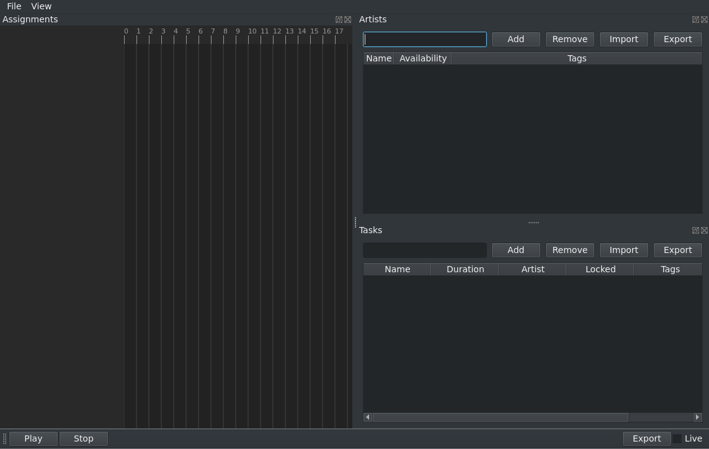
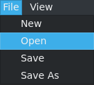
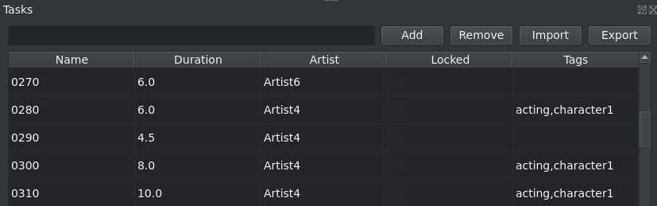
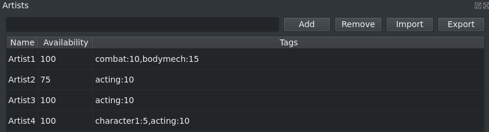
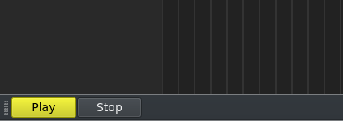
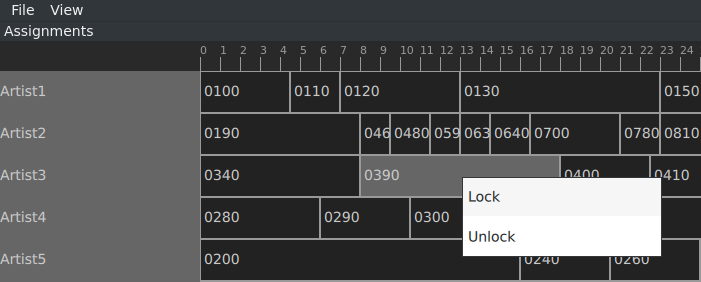
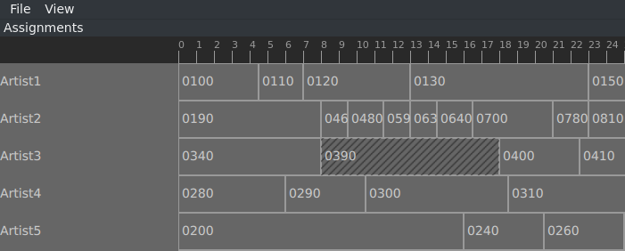
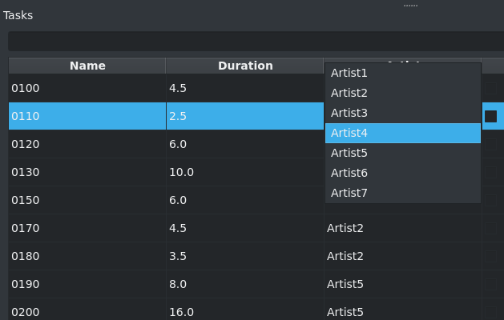
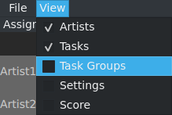
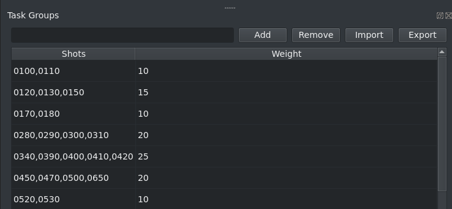

[](https://github.com/renaudll/csp4cg/actions)
[](https://codecov.io/gh/renaudll/csp4cg)
[](http://mypy-lang.org/)
[](https://github.com/psf/black)

CSP solver for task assignation.

# Abstract

In CG/VFX industry, the process of assigning tasks to artists is often done by hand.
When doing the assignations, the manager have to think about multiple variables, ie:
- Assigning workload evenly, in relation to each artists capacity
- Satisfy artists preferences toward specific tasks
- Assigning hard task to more experiences artists
- Ensuring some group of tasks are assigned to the same artist, etc

Dealing with all theses constraints, and often assignments are done using a process of elimination.
Not only this might not give the best possible result, this process have to be redone each time the number of tasks/artists change which can happen often.

Problems that can be described by a set of constraints are called a [constraint satisfaction problem](https://en.wikipedia.org/wiki/Constraint_satisfaction_problem) (CSP). 
Popular problems of the same kind are a Sudoku or the [8 queens problem](https://www.brainmetrix.com/8-queens). 
What's neat about theses is that they can all be solved with the same approach. 
Constraints are defined, a solver explore solutions and perform linear regression on the problem until the best solution emerge. 

This tool does exactly that using this workflow:
1) Define/import artists and tasks
2) Define constraints
3) Generate a solution
4) Validate the results, if not satisfying return to step 2 and clarify the constraints.
5) Once a proper solution is found, export the assignations and import them elsewhere.


# Installation (Windows)

1. Go to [python.org](https://www.python.org/downloads/) and install python-3.8.
2. Double-click the `bootstrap.bat` script.

Running the script the first time might take time. It should be fast afterward.

# Installation (Linux)

See the [Development](#Development) section.

# Usage

When you open the application for the first time, you'll be greeted with an empty window.



From there you can start adding artists and tasks with the `Add` or `Import` buttons.

For now, let's load the `examples/tasks.yml` file via the `File > Open` menu.



## Tagging

In the `Tasks` view, you can add "tags". Tags are separated by comma (`,`).



In the `Artists` view, you can set artists preferences for certain tags. 
Tags are separated by a comma (`,`) and contain a name and a score separated by a colon (`:`).
The score is an amount of point given to the solver if the preference is satisfied.
The solver always try to get the highest score possible so if an artist preference is more important, it's associated score should be higher.




## Solving



When you add, remove or modify something, the `Play` button will turn yellow.
This indicate that a new solve need to be performed.

To solve, press the `Play` button or the `space bar` on you keyboard.
Depending on the problem, the solving can run for a long time. 
You should get decent results in the first 5 seconds.


At any time, you can stop the solver by pressing `space bar` again or the `Stop` button.

## Locking assignments

Once you are satisfied with an assignment, you can lock then by clicking on the task.



Once an assignment is locked. The solver won't be able to change it under any circumstances. Locked tasks have a dashed visual.



You can also manually assign a task to an artist by double clicking on an `Artist` cell in the `Tasks` table. This will automatically lock the assignment.



## Advanced usage

For more advances usage, you can access additional panels via the `View` menu.



One such tools it the `Task Groups` panel which allow you to give additional points if multiple tasks are assigned to the same artist.



The `Settings` panel expose the solver internal parameter. You should need to adjust it.

The `Score` panel explained the decisions the solver took.

# Development

This project require python-3.8.
If you don't have python-3.8 available you can obtain if with pyenv.

```bash
python3.8 -m venv venv  # Create a python virtualenv
source venv/bin/activate  # Enter the virtualenv
pip install poetry  # Install poetry
poetry install  # Initialize project
poetry run pytest  # Run tests
python -m csp4cg  # Open the application
```
